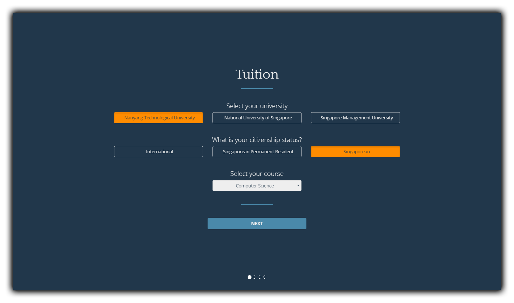
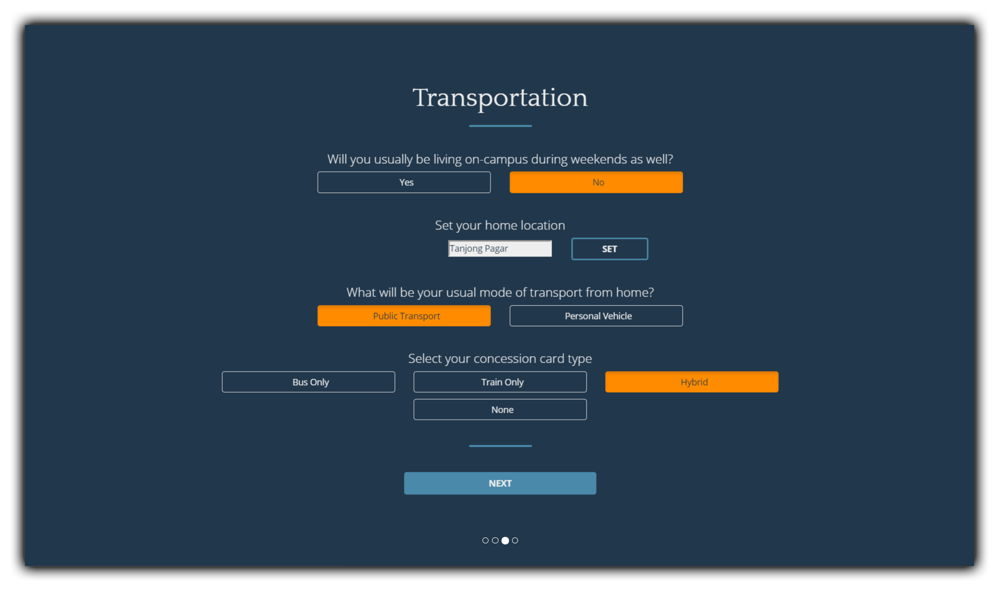
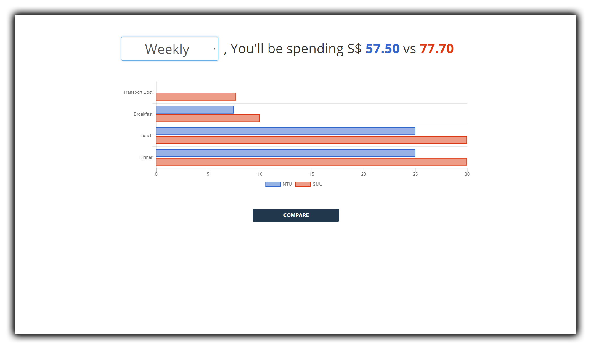

# PreparedForU
A simple webapp for university aspirants and students in Singapore to estimate and compare their spending on tuition, housing, transport and rent, and make financially smart decisions based on data visualization.

Built with Vue.js and Firebase. All calculations were based on publically available university data (scraped with Selenium), OneMapSG Routing API and Singapore Government Transport Fares APIs.

# To-do
* Learn about Compartments in Vue and restructure code into reusable compartments.
* Deploy with Heroku/Firebase(?)\
* Improve README


# Screenshots






# Build Setup

``` bash
# install dependencies
npm install

# serve with hot reload at localhost:8080
npm run dev

# build for production with minification
npm run build

# build for production and view the bundle analyzer report
npm run build --report
```

For a detailed explanation on how things work, check out the [guide](http://vuejs-templates.github.io/webpack/) and [docs for vue-loader](http://vuejs.github.io/vue-loader).
